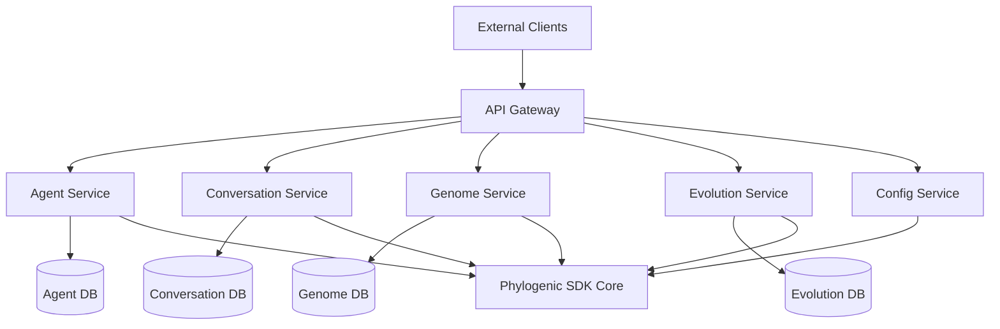

# Phylogenic SDK API Specifications

This directory contains comprehensive **OpenAPI 3.1 specifications** for the Phylogenic SDK, providing formal API contracts for all interfaces and integrations.

## 📋 API Specification Overview

Phylogenic is a Python SDK for genome-based conversational AI, but these OpenAPI specs document how external systems can integrate with, monitor, and manage Phylogenic deployments through REST APIs.

### Core API Specifications

| Specification | Purpose | Key Endpoints |
|---------------|---------|---------------|
| **[`schemas.yaml`](schemas.yaml)** | Shared data models | Common types, error responses, pagination |
| **[`agent.yaml`](agent.yaml)** | Agent lifecycle management | Create agents, monitoring, configuration |
| **[`conversation.yaml`](conversation.yaml)** | Chat interactions | Real-time conversations, history, analytics |
| **[`genome.yaml`](genome.yaml)** | Genome CRUD operations | Genome management, analysis, version control |
| **[`evolution.yaml`](evolution.yaml)** | AI evolution runs | Genetic algorithm orchestration, monitoring |
| **[`config.yaml`](config.yaml)** | Configuration management | Settings, environments, profiles |

## 🚀 Quick Start

### View API Documentation

```bash
# Install OpenAPI/Swagger tools
npm install -g @apidevtools/swagger-cli swagger-ui-watcher

# Serve interactive API docs
swagger-ui-watcher docs/api/agent.yaml
```

### Generate Client SDKs

```bash
# Generate Python client
openapi-generator-cli generate \
  -i docs/api/agent.yaml \
  -g python \
  -o generated/python-client

# Generate TypeScript client
openapi-generator-cli generate \
  -i docs/api/conversation.yaml \
  -g typescript-fetch \
  -o generated/typescript-client
```

## 🔧 API Architecture

### Server Architecture


### Design Principles

- **RESTful Design**: Consistent HTTP methods, resource-oriented URLs
- **Pagination**: Consistent pagination for list endpoints
- **Filtering & Sorting**: Standardized query parameters
- **Error Handling**: Structured error responses with correlation IDs
- **Security**: Token-based authentication, role-based access
- **Versioning**: URL path versioning (/v1/), semantic versioning

## 📖 Using the Specifications

### 1. Understanding the Data Models

All specifications reference **shared schemas** in [`schemas.yaml`](schemas.yaml):

```yaml
# Key shared components:
- TraitDict: 8-trait genome personality encoding
- AgentConfig: Complete agent configuration
- ConversationTurn: Chat message structure
- EvolutionResult: Genetic algorithm outcomes
```

### 2. Authentication & Authorization

```bash
# Example: Bearer token auth
curl -H "Authorization: Bearer $PHYLOGENIC_API_TOKEN" \
     https://api.phylogenic.ai/v1/agents
```

**Required Headers:**
- `Authorization: Bearer <token>` - API authentication
- `X-Correlation-ID` - Request tracing (optional)
- `Content-Type: application/json` - For JSON requests

### 3. Common Patterns

#### Pagination
```yaml
# All list endpoints support:
GET /resource?page=1&page_size=20

Response:
{
  "data": [...],
  "pagination": {
    "page": 1,
    "page_size": 20,
    "total_pages": 5,
    "total_items": 100
  }
}
```

#### Filtering
```yaml
# Resource-specific filters:
GET /genomes?tags=production&generation=5
GET /evolution/runs?status=completed&algorithm=elitist_ga
```

#### Error Handling
```yaml
# Standardized error responses:
{
  "error": "validation_error",
  "message": "Request validation failed",
  "details": {...},
  "correlation_id": "req_12345",
  "timestamp": "2025-12-10T19:00:00Z"
}
```

## 🎯 Key Integration Scenarios

### 1. **Agent Management Integration**

```python
# Python client example
from phylogenic_client import PhylogenicApi

client = PhylogenicApi(base_url="https://api.phylogenic.ai/v1")

# Create a customer service agent
agent = client.create_agent({
    "genome_id": "customer_service_v2",
    "config": {
        "llm_provider": "openai",
        "model_name": "gpt-4-turbo"
    }
})

# Monitor agent health
health = client.get_agent_status(agent["agent_id"])
```

### 2. **Real-time Chat Integration**

```javascript
// WebSocket client for streaming chat
const ws = new WebSocket('wss://api.phylogenic.ai/v1/conversation/live');

ws.onmessage = (event) => {
    const update = JSON.parse(event.data);
    if (update.event === 'chat_response') {
        displayMessage(update.data.message);
    }
};
```

### 3. **Genome Version Control**

```bash
# Export genome for backup
curl -X POST https://api.phylogenic.ai/v1/genomes/customer_service_v2/export \
  -d '{"format": "yaml"}' \
  --output genome_backup.yaml

# Import genome from file
curl -X POST https://api.phylogenic.ai/v1/genomes/import \
  -F "config_file=@genome_backup.yaml"
```

### 4. **Evolution Monitoring**

```python
# Monitor evolution progress
evolution = client.start_evolution_run({
    "base_genome_id": "base_agent",
    "config": {"population_size": 100, "generations": 50}
})

# Real-time progress updates
while True:
    status = client.get_evolution_progress(evolution["run_id"])
    print(f"Generation {status['current_generation']}: {status['current_best_fitness']}")
    if status["status"] == "completed":
        break
```

## 🔒 Security Considerations

### Authentication
- **Bearer Tokens**: Required for all API endpoints
- **Token Scopes**: Granular permissions (read, write, admin)
- **Expiration**: Tokens expire and require renewal

### Data Protection
- **Encryption**: All data encrypted in transit and at rest
- **PII Handling**: Automatic detection and masking of personal data
- **Audit Logging**: All API calls logged with compliance trails

### Rate Limiting
- **Global Limits**: Request-per-minute limits per token
- **Burst Handling**: Token bucket algorithm for fair queuing
- **Backpressure**: Proper HTTP status codes (429) for rate limits

## 🧪 Testing & Validation

### API Testing

```bash
# Lint OpenAPI specs
swagger-cli validate docs/api/agent.yaml

# Generate integration tests
openapi-generator-cli generate \
  -i docs/api/conversation.yaml \
  -g python \
  -o test/generated \
  --additional-properties=packageName=phylogenic_api_tests
```

### Mock Server

```bash
# Start mock API server for testing
npm install -g prism
prism mock docs/api/agent.yaml --host 0.0.0.0 --port 4010
```

### Contract Testing

```yaml
# Example Pact contract
pact:
  consumer: "MyApp"
  provider: "PhylogenicAPI"
  interactions:
    - description: "Create customer service agent"
      request:
        method: POST
        path: "/agents"
        body:
          genome_id: "customer_service_v2"
      response:
        status: 201
```

## 📊 Monitoring & Observability

### Health Checks

```bash
# API health endpoint
curl https://api.phylogenic.ai/v1/agents/health

# Configuration health
curl https://api.phylogenic.ai/v1/config/health
```

### Metrics Integration

```yaml
# Prometheus metrics exposed at /metrics
agent_requests_total{agent_id="agent_123", method="POST"} 150
evolution_run_duration_seconds{run_id="evo_456"} 1847.2
genome_trait_changes_total{trait="empathy"} 23
```

### Logging

```json
{
  "timestamp": "2025-12-10T19:00:15Z",
  "level": "INFO",
  "correlation_id": "req_12345",
  "agent_id": "agent_789",
  "event": "chat_response_generated",
  "duration_ms": 1247,
  "quality_score": 0.91
}
```

## 🚀 Deployment Considerations

### Container Deployment

```dockerfile
FROM python:3.11-slim

# Copy OpenAPI specs for validation
COPY docs/api/ /app/docs/api/

# Install dependencies
RUN pip install phylogenic-sdk

# Health check via API
HEALTHCHECK --interval=30s --timeout=10s --start-period=60s \
  CMD curl -f http://localhost:8000/v1/agents/health || exit 1

EXPOSE 8000
```

### Kubernetes Integration

```yaml
apiVersion: v1
kind: ConfigMap
metadata:
  name: phylogenic-api-specs
data:
  schemas.yaml: |
    # OpenAPI specs embedded as ConfigMaps
    openapi: 3.1.0
    info:
      title: Phylogenic Schemas
      version: 1.0.0
```

## 🛠️ Development & Contribution

### Adding New Endpoints

1. **Define Schema**: Add to `schemas.yaml` for shared types
2. **Create Spec**: Add to appropriate API spec file
3. **Validate**: Run `swagger-cli validate` on all specs
4. **Generate Docs**: Update API documentation
5. **Write Tests**: Add integration tests for new endpoints

### Schema Evolution

```yaml
# Version compatibility
info:
  version: 1.1.0

# Backward compatible changes only
# - Add optional properties
# - Add new enum values
# - Add new endpoints

# Breaking changes require new API version
```

## 📚 Additional Resources

### Related Documentation
- [Phylogenic SDK Documentation](../README.md)
- [Configuration Guide](../docs/configuration.md)
- [LLM Integration Guide](../docs/LLM_INTEGRATION.md)

### Tooling
- [OpenAPI Generator](https://openapi-generator.tech/) - Generate clients
- [Swagger Editor](https://editor.swagger.io/) - Edit specifications
- [Postman Collections](https://www.postman.com/) - Import API specs
- [Insomnia](https://insomnia.rest/) - REST client with OpenAPI support

### Standards
- [OpenAPI 3.1 Specification](https://spec.openapis.org/oas/v3.1.0)
- [JSON Schema](https://json-schema.org/)
- [RFC 7807: Problem Details](https://tools.ietf.org/html/rfc7807)

---

**Need Help?**
- 📧 Email: jimmydejesus1129@gmail.com
- 📖 Documentation: [Phylogenic SDK Docs](../docs/)
- 🔗 Repository: [GitHub](https://github.com/phylogenic-ai/phylogenic)
